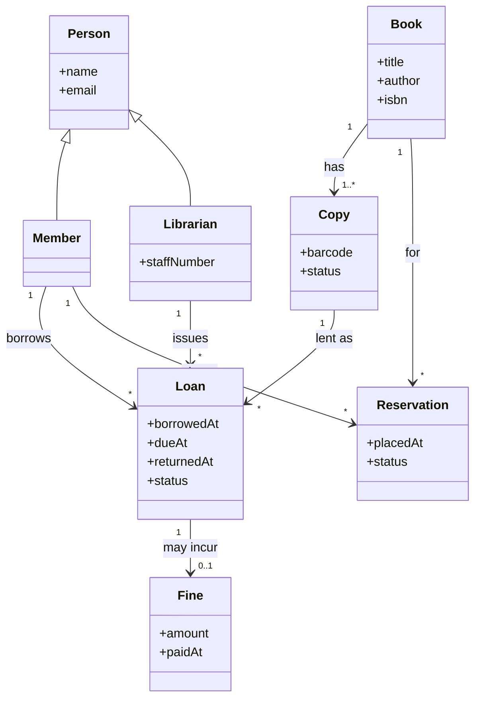

# SWEN90007-demo
a repo for tutorial demo testing

```mermaid
classDiagram

%% ==========================
%% Generalisation
%% ==========================
Person <|-- Member
Person <|-- Librarian

%% ==========================
%% Associations
%% ==========================
Book "1" --> "1..*" Copy : has
Member "1" --> "*" Loan : borrows
Copy "1" --> "*" Loan : lent as
Librarian "1" --> "*" Loan : issues
Member "1" --> "*" Reservation : places
Book "1" --> "*" Reservation : for
Loan "1" --> "0..1" Fine : may incur

%% ==========================
%% Classes
%% ==========================
class Person {
    +name
    +email
}

class Member

class Librarian {
    +staffNumber
}

class Book {
    +title
    +author
    +isbn
}

class Copy {
    +barcode
    +status
}

class Loan {
    +borrowedAt
    +dueAt
    +returnedAt
    +status
}

class Reservation {
    +placedAt
    +status
}

class Fine {
    +amount
    +paidAt
}
```
